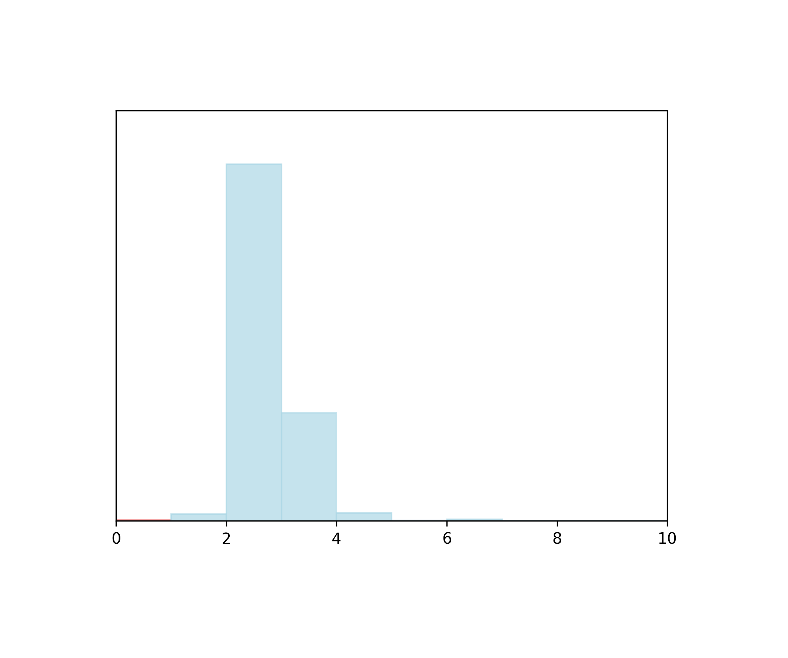
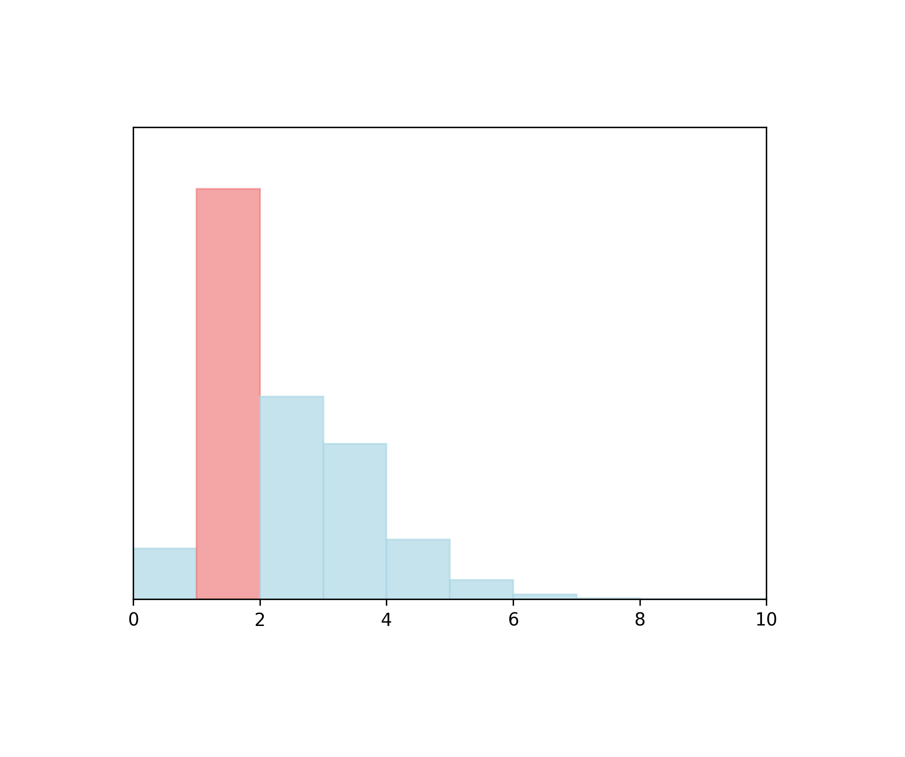
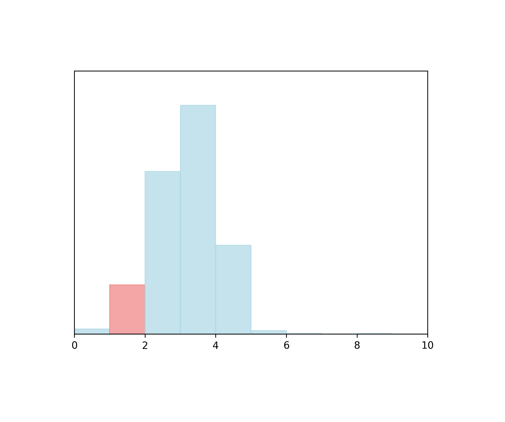

# roughViz

- **Website Link:** [[link](https://github.com/jwilber/roughViz)]
- *as of 2024.01.31.<!-- GitHub Commit History for this file: [[link]](https://github.com/jwilber/roughViz/commits/master/) -->*
- Note: All visualizations show normalized metric values and exclude missing/null metric values.
  

## Community Activity and Integrity

- **Percentile: 76** 

Activity and usage by this project’s consumers and contributors, as compared to those of the top 1000 most-downloaded npm libraries. More people using and contributing to this project increases these metrics.

### Detailed Metrics

- **Usage Popularity:** 363/1000 

  
  How much consumers use this project: stars, watches, forks, downstream dependents.

- **Contributor Participation:** 979/1000 

  
  Activity in discussion and participation: number of contributors, comments made, length of comments

- **Code Contribution:** 236/1000 

  
  Activity in the codebase: commits and PRs

- **Contributor Growth:**  No contributor growth found in last 7 months. 
  
  How the project is scaling in size: change in contributors, PRs

## Maintenance and Goodwill

- **Percentile: 48.4** 

Activity and involvement by this project’s maintainer(s) for the benefit of the project community, as compared to those of the top 1000 most-downloaded npm libraries. Maintainers could increase these metrics by extending documentation and being more responsive to community participation (especially issues and PRs).

### Detailed Metrics

- **Issues Maintenance:** 497/1000 

  
  How efficiently issues are addressed: issues closed, comments on issues

- **Code Maintenance:** 114/1000 

  
  How efficiently code changes are addressed: PRs closed, commit activity

- **Community Documentation:** 413/1000 

  
  Support for the community to participate: issue and PR templates, code of conduct, governance, etc.
  
- **Maintainer History:** 144/1000 

  
  Maintainer experience: maintainers' other projects
  
  

## Code Quality

- **Percentile: 70.3** 

Security and scalability of the project’s code, as compared to those of the top 1000 most-downloaded npm libraries. Contributors can increase these metrics by maintaining the dependencies and setting up automated testing and procedural reviews.

### Detailed Metrics

- **Dependencies Health:** 524/1000 

  Mitigation of dependency vulnerabilities: dependency versions, reported vulnerabilities

- **Testing Quality:** 348/1000 

  
  Scale of automated tests: workflow runs, check runs, code authors

- **Review Coverage:** 142/1000 

  Scale of manual code reviews: contributors and reviewers per code portion
  
- **Project Maturity:** 988/1000 

  
  Size and age of repo: creation time, versions