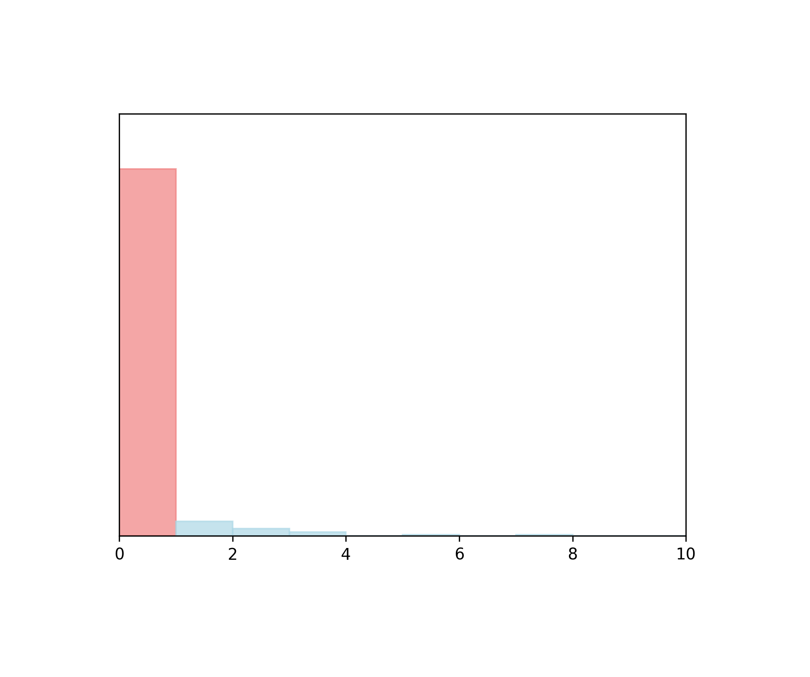

# voice-listener

- **Website Link:** [[link](https://github.com/nithincvpoyyil/voice-listener)]
- *as of 2024.01.31. GitHub Commit History for this file: [[link]](https://github.com/nithincvpoyyil/voice-listener/commits/master/)*
- Note: All visualizations show normalized metric values and exclude missing/null metric values.

## Community Activity and Integrity

- **Percentile: 93.8** 

Activity and usage by this project’s consumers and contributors, as compared to those of the top 1000 most-downloaded npm libraries. More people using and contributing to this project increases these metrics.

### Detailed Metrics

- **Usage Popularity:** 997/1000 

  
  How much consumers use this project: stars, watches, forks, downstream dependents.

- **Contributor Participation:** 827/1000 

  
  Activity in discussion and participation: number of contributors, comments made, quality of comments

- **Code Contribution:** 328/1000 

  
  Ability to add to the codebase: commits and PRs

- **Contributor Growth:** No contributor growth found in last 7 months.

  How the project is scaling in size: change in contributors, PRs

[Metric Details](https://github.com/tonyli1/TrustLabel_Display/blob/bdbf8d8c8e10a65aaa5b4274c9d158e600d6f8c4/markdown/Metrics_detail_template_Component_(Integrity)_voice.md)

## Maintenance and Goodwill

- **Percentile: 93.8** 

Activity and involvement by this project’s maintainer(s) for the benefit of the project community, as compared to those of the top 1000 most-downloaded npm libraries. Maintainers could increase these metrics by extending documentation and being more responsive to community participation (especially issues and PRs).

### Detailed Metrics

- **Issues Maintenance:** No issue found in last 7 months.
  
  How efficiently issues are addressed: issues closed and comments on issues

- **Code Maintenance:** No commit or closed pull request found in last 7 months.
  
  How efficiently code changes are addressed: commits and PRs closed, commit activity

- **Community Documentation:** 764/1000 

  Support for the community to participate: issue and PR templates, code of conduct, governance, etc.

- **Maintainer History:** 935/1000 

  Maintainer experience: maintainers' other projects

[Metric Details](https://github.com/tonyli1/TrustLabel_Display/blob/bdbf8d8c8e10a65aaa5b4274c9d158e600d6f8c4/markdown/Metrics_detail_template_Component_(Integrity)_voice.md)

## Code Quality

- **Percentile: 86.1** 

Security and review of the project’s code, as compared to those of the top 1000 most-downloaded npm libraries. Contributors can increase these metrics by maintaining the dependencies and setting up automated testing and procedural reviews.

### Detailed Metrics

- **Dependencies Health:** 735/1000 

  Mitigation of dependency vulnerabilities: dependency versions, reported vulnerabilities

- **Testing Quality:** No test found
  
  Scale of automated tests: workflow runs, check runs, code authors

- **Review Coverage:** 956/1000 

  Scale of manual code reviews: contributors and reviewers per code portion
  
- **Project Maturity:** 885/1000 

  Size and age of repo: creation time, versions

[Metric Details](https://github.com/tonyli1/TrustLabel_Display/blob/bdbf8d8c8e10a65aaa5b4274c9d158e600d6f8c4/markdown/Metrics_detail_template_Component_(Integrity)_voice.md)