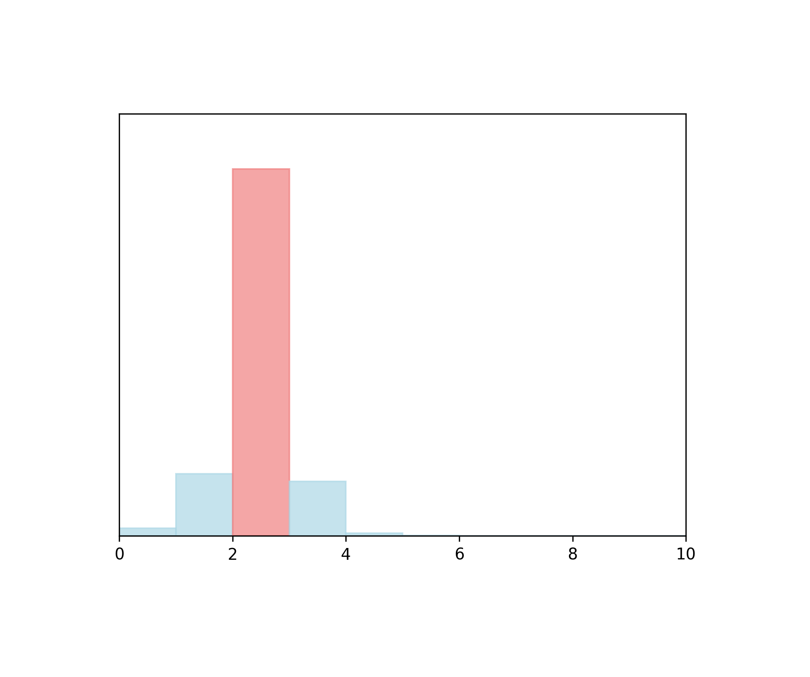

# twopasswords

- **Website Link:** [[link](https://github.com/gennadis/twopasswords)]
- *as of 2024.01.31. GitHub Commit History for this file: [[link]](https://github.com/gennadis/twopasswords/commits/main/)*
- Note: All visualizations show normalized metric values and exclude missing/null metric values.

## Maintenance

- **Percentile: 971/1000** 

Activity and involvement by this project’s maintainer(s), as compared to those of the top 1000 most-downloaded npm libraries. Maintainers could increase these metrics by extending documentation and being more responsive to community participation (especially issues and PRs).

### Detailed Metrics

- **Issues Maintenance:** No issue found.
  
  How efficiently issues are addressed: issues closed and comments on issues

- **Code Maintenance:** 778/1000 

  
  How efficiently code changes are addressed: commits and PRs closed, commit activity

- **Community Documentation:** 638/1000

  Support for the community to participate: issue and PR templates, code of conduct, governance, etc.

- **Maintainer History:** 978/1000 

  Maintainer experience: maintainers' other projects

[Metric Details]("https://github.com/tonyli1/TrustLabel_Display/blob/bdbf8d8c8e10a65aaa5b4274c9d158e600d6f8c4/markdown/Metrics_detail_template_Trustee_(MCPC)_twopasswords.md")

## Contribution

- **Percentile: 1000/1000** 

Activity and involvement by this project’s contributors, as compared to those of the top 1000 most-downloaded npm libraries. Fostering and encouraging more contribution and participation would increase these metrics.

### Detailed Metrics

- **Contributor Participation:** 1000/1000 

  
  Activity in discussion and participation: number of contributors, comments made, quality of comments

- **Code Contribution:** No commit and pull request found in last 7 months.
  
  Ability to add to the codebase: commits and PRs

- **Contributor Growth:** No contributor growth found in last 7 months.

  How the project is scaling in size: change in contributors, PRs

[Metric Details]("https://github.com/tonyli1/TrustLabel_Display/blob/bdbf8d8c8e10a65aaa5b4274c9d158e600d6f8c4/markdown/Metrics_detail_template_Trustee_(MCPC)_twopasswords.md")
  

## Popularity

- **Percentile: 996/1000** 

Activity and usage by this project’s consumers, as compared to those of the top 1000 most-downloaded npm libraries. Spreading this project to more users and maintaining it over time increases these metrics.

### Detailed Metrics

- **Stars and Watches**: 997/1000 

  How much consumers follow this project: stargazers, watchers

- **Forks**: No fork found.

  How much consumers build off this project: forks

- **Project Maturity:** : 994/1000 

 

  Size and age of repo: creation time, versions

- **Downstream Dependents**:  No downstream dependent found.

  For projects producing packages and dependencies, how many downstream projects rely on them

[Metric Details]("https://github.com/tonyli1/TrustLabel_Display/blob/bdbf8d8c8e10a65aaa5b4274c9d158e600d6f8c4/markdown/Metrics_detail_template_Trustee_(MCPC)_twopasswords.md")

## Code Quality

- **Percentile: 755/1000** 

Security and review of the project’s code, as compared to those of the top 1000 most-downloaded npm libraries. Contributors can increase these metrics by maintaining the dependencies and setting up automated testing and procedural reviews.

### Detailed Metrics

- **Dependencies Health:** 418/1000 

  Mitigation of dependency vulnerabilities: dependency versions, reported vulnerabilities

- **Testing Quality:** No test found.
  
  Scale of automated tests: workflow runs, check runs, code authors

- **Review Coverage:** 924/1000 

  Scale of manual code reviews: contributors and reviewers per code portion

[Metric Details]("https://github.com/tonyli1/TrustLabel_Display/blob/bdbf8d8c8e10a65aaa5b4274c9d158e600d6f8c4/markdown/Metrics_detail_template_Trustee_(MCPC)_twopasswords.md")