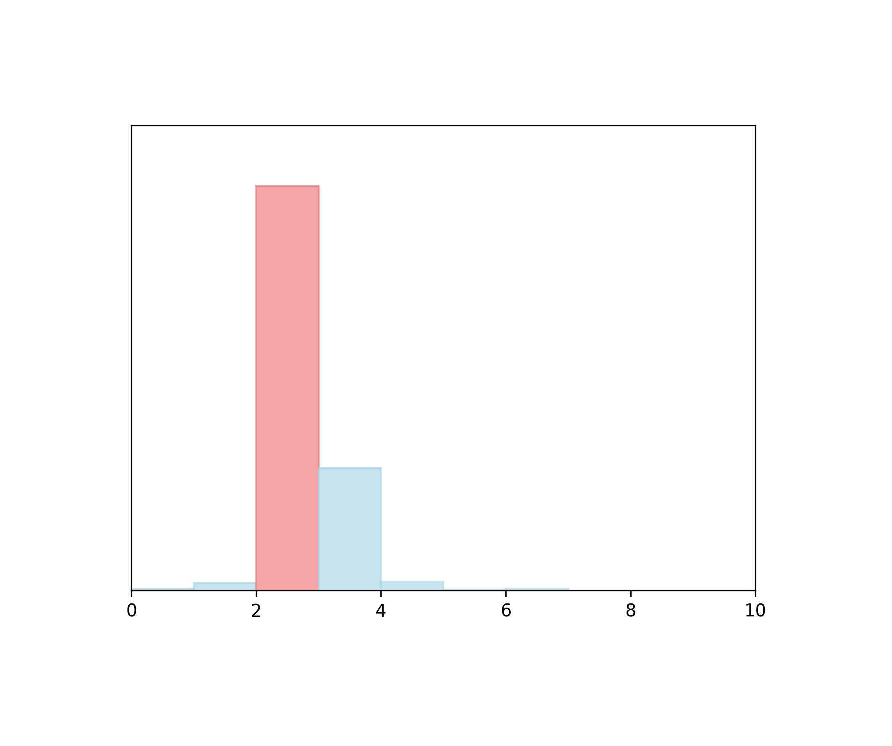
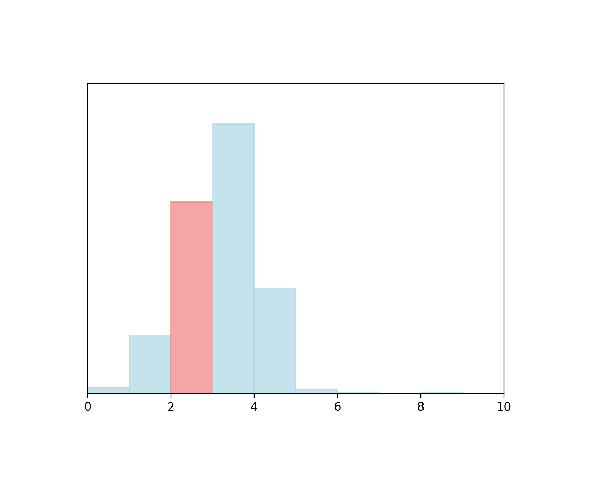
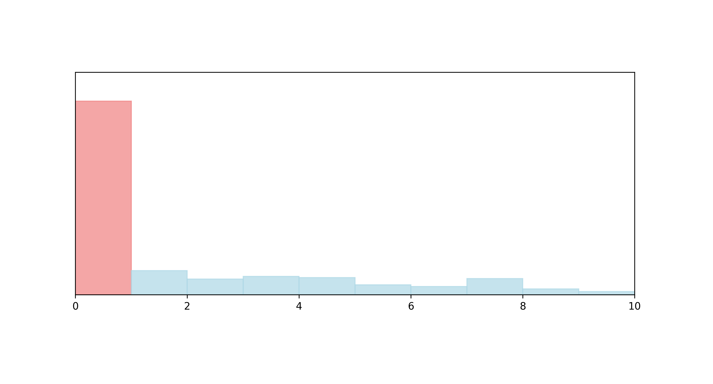

# voice-listener

- **Website Link:** [[link](https://github.com/nithincvpoyyil/voice-listener)]
- *as of 2024.01.31. GitHub Commit History for this file: [[link]](https://github.com/nithincvpoyyil/voice-listener/commits/master/)*
- Note: All visualizations show normalized metric values and exclude missing/null metric values.

## Maintenance

- **Percentile: 938/1000** 

Activity and involvement by this project’s maintainer(s), as compared to those of the top 1000 most-downloaded npm libraries. Maintainers could increase these metrics by extending documentation and being more responsive to community participation (especially issues and PRs).

### Detailed Metrics

- **Issues Maintenance:** No issue found in last 7 months.
  
  How efficiently issues are addressed: issues closed and comments on issues

- **Code Maintenance:** No commit or closed pull request found in last 7 months.
  
  How efficiently code changes are addressed: commits and PRs closed, commit activity

- **Community Documentation:** 764/1000 

  Support for the community to participate: issue and PR templates, code of conduct, governance, etc.

- **Maintainer History:** 935/1000 

  Maintainer experience: maintainers' other projects

## Contribution

- **Percentile: 770/1000** 

Activity and involvement by this project’s contributors, as compared to those of the top 1000 most-downloaded npm libraries. Fostering and encouraging more contribution and participation would increase these metrics.

### Detailed Metrics

- **Contributor Participation:** 827/1000 

  
  Activity in discussion and participation: number of contributors, comments made, quality of comments

- **Code Contribution:** 328/1000 

  
  Ability to add to the codebase: commits and PRs

- **Contributor Growth:** There's no contributor growth in last 7 months.

  How the project is scaling in size: change in contributors, PRs

  

## Popularity

- **Percentile: 909/1000** 

Activity and usage by this project’s consumers, as compared to those of the top 1000 most-downloaded npm libraries. Spreading this project to more users and maintaining it over time increases these metrics.

### Detailed Metrics

- **Stars and Watches**: 997/1000 

  How much consumers follow this project: stargazers, watchers

- **Forks**: 999/1000 

  How much consumers build off this project: forks

- **Project Maturity:** 885/1000 

  Size and age of repo: creation time, versions

- **Downstream Dependents**: 970/1000 

  For projects producing packages and dependencies, how many downstream projects rely on them

## Code Quality

- **Percentile: 861/1000** 

Security and review of the project’s code, as compared to those of the top 1000 most-downloaded npm libraries. Contributors can increase these metrics by maintaining the dependencies and setting up automated testing and procedural reviews.

### Detailed Metrics

- **Dependencies Health:** 735/1000 

  Mitigation of dependency vulnerabilities: dependency versions, reported vulnerabilities

- **Testing Quality:** No test found.
  
  Scale of automated tests: workflow runs, check runs, code authors

- **Review Coverage:** 956/1000 

  Scale of manual code reviews: contributors and reviewers per code portion